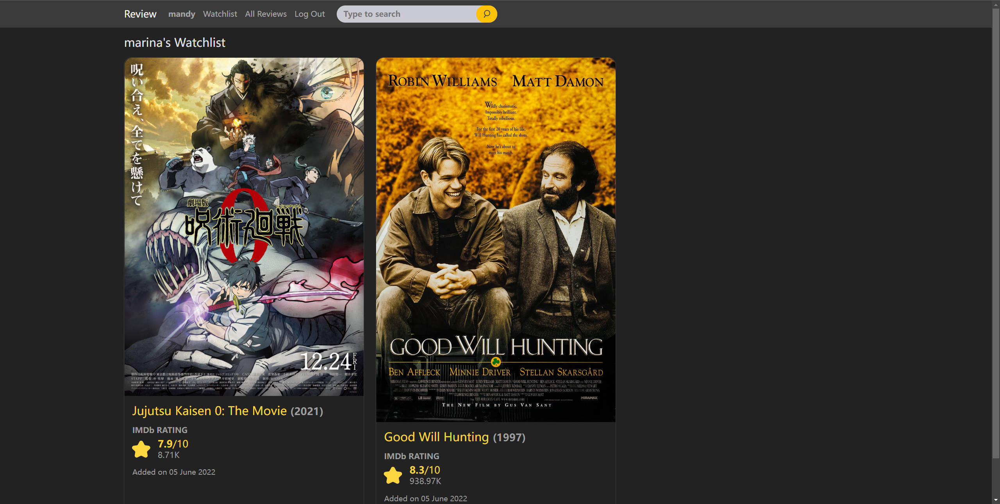

# A rating website

## Distinctiveness
My vision is to build a rating website that allows users to find interested movies or TV series based on ratings from both IMDB and other users. Hence this project contains the functionality of searching titles along with their IMDB ratings. Other users' ratings, if any, wil also be presented beside the title name. Moreover, users can add interested titles to their watch list. This project is distinct from the projects in CS50W. It is not a Pizza restaurant ordering system, an e-commerce website, or a social network.

## Complexity Requirements
This project...
- utilizes Django on the back-end
- has at least one model -- there are 4 in total
- utilizes JavaScript on the front-end to make API requests and to provide dynamic web pages
- is mobile responsive by including bootstrap CSS. Page contents are adjusted based on viewpoints.
- applies CSS to achieve some animations, e.g., changing the displaying style of rating stars based on user's action
- utilizes session to display different searching results for each user

## Application: "review"
The Django project has one application: review.

### Files added
#### CSS file
- "\review\static\review\styles.css": The css stylesheet containing all the custom styles for the project
#### JavaScript file
- "\review\static\review\card.js" contains the JavaScript used to make API requests and respond to user's actions. It achieves several functionalities:
    - Toggle between '+ Add to Watchlist' and '✓ In Watchlist'
    - Change the number inside the badge beside the 'Watchlist' link when clicking on '+ Add to Watchlist' or '✓ In Watchlist'
    - Make API requests when users search a title and then process the returned results. Finally, post results to the page and then reload the page to show the results.
    - After the user rating a title, set button.disabled to false. Therefore the user can submit the rating.
#### Python files
- "\capstone\urls.py" holds urlpatterns for the application
- "\review\admin.py" registers Django models
- "\review\models.py" defines four models: User, Review, Item, Card
- "\review\urls.py" holds the urls for this application
- "\review\views.py" - I added several views and API endpoints for the website, including:
    - index: Shows all the reviews made by users
    - search: Shows all the search results
    - login_view: Shows login page
    - logout_view: Redirect the user to index page
    - register: Shows register page
    - watchlist: Shows items in watchlist
    - profile: Shows all ratings of a user, sorting by most recent
    - profile_top: Shows all ratings of a user, sorting by top rated
    - rating: Update or create a Review model instance
    - add: Add a title to request user's watchlist
    - remove: Remove a title from request user's watchlist
#### HTML files
- "\review\templates\review\layout.html": Basic layout that contains navbar.
- "\review\templates\review\login.html": Login page that extends layout.html
- "\review\templates\review\register.html": Register page that extends layout.html
- "\review\templates\review\index.html": All reviews page that extends cards.html
- "\review\templates\review\cards.html": A layout template that extends layout.html. Mainly for displaying movies in cards
- "\review\templates\review\search.html": Can be watchlist page, profile page or search page. Extends cards.html
#### Images
- "\review\static\review\favicon.png": The site's logo
- "\screen1.jpg": A screenshot about the index page when logged-in
- "\screen2.jpg": A screenshot about the index page when logged-out
- "\screen3.jpg": A screenshot about the watchlist page
#### TXT file
- "\requirements.txt" contains all the environment requirements

### Run the application
First download repository. Then change to the directory where manage.py lies. Next, in the terminal, type python manage.py runserver. Finally, go to http://127.0.0.1:8000/.

### Features
#### Navbar
A navbar is presented at the top of all pages. The navbar contents will change based on the user's login status. Besides, at small viewpoints, the navbar will auto collapse.

#### Search
Navbar contains a search bar that allows users to find movies or TV series. Once the user searches a title, the server will make API requests to IMDb and OMDB. Then the results returned from IMDb and OMDB are displayed to the user. Note that unpopular titles (with less than 100 ratings on IMDB and/or do not have a poster) are removed from the results. These results are often not much related to the user's input.

#### Watchlist
logged-in users can add movies or TV series to their watchlist by clicking a '+ Add to Watchlist' button. After clicking, the button will turn gray, showing '✓ In Watchlist'. Meanwhile, the number inside the badge beside 'Watchlist' in the navbar will increment by 1. Inside the Watchlist page, the user will see all the titles added in reverse chronological order. Besides, a logged-in user can view other users' watchlists.

#### Profile
The Profile page shows all the ratings that belong to a user. Two sorting methods are provided: most recent and top-rated. Similarly, a logged-in user can view other users' profiles. Users can also edit their own ratings by clicking the 'Edit This' button.

#### All Reviews
The All Reviews page contains all ratings or reviews made by users. If multiple users rate one movie, all ratings and the reviewer's name will be displayed below the title in reverse chronological order. All the titles are ordered by the time that they are last rated, with last rated titles being at the front.

## Screenshots
### All Reviews Page (Logged-in)

### All Reviews Page (Logged-out)

### Watchlist Page

